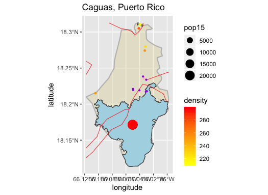
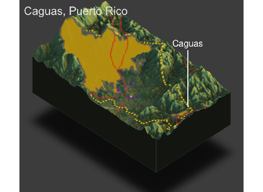

# Puerto Rico

This is my final project for Puerto Rico

## ADMINISTRATIVE SUBDIVISIONS

### Puerto Rico is an island and U.S. territory located in the Caribbean Sea in Central America. The political subdivisions of Puerto Rico consist of international borders and 78 different municipalities. Each municipality elects a mayor and legislature to govern and control day to day life in the municipality. I selected the municipality of Caguas, Puerto Rico for my project. Caguas is located on the eastern side of Puerto Rico and shares its northern border with the municipality of San Juan. Caguas also shares its border with the municipalities of Aguas Buenas, Cidra, and Cayey to the west, and San Lorenzo, Gurabo, and Trujillo Alto to the east. 

## POPULATION OF MUNICIPALITIES
### The population of Puerto Rico is three million and is greatly affected by the topography. Puerto Rico is very mountainous in its southern and central regions, resulting in the most populous areas to be located towards the north. 

### Of Puerto Rico's municipalities, San Juan is the most populated. This is expected because San Juan, the capital of Puerto Rico is located in the municipality. San Juan is by far the most densely populated municipality in Puerto Rico, with Bayamón, the second most dense municipality, a little more than half as densely populated.

### Puerto Rico's population mostly lives in towns and villages across rural areas. A dense population lives in large cities like San Juan and Caguas, but the population is smaller compared to the Puerto Ricans living in smaller towns. 

## HUMAN SETTLEMENTS, ROADWAYS, AND HEALTHCARE FACILITIES 
### Caguas’ topography consists of mountainous regions, which determine the location of facilities in the municipality. The development of urban populations has been impacted by the topography because the larger populated area in the south is built up of smaller communities and not as connected as the populated urban area in the north due to the challenge of building infrastructure in mountainous regions.

### The roads and hospitals are located in less mountainous areas due to the difficulty of building infrastructure in uneven surfaces and higher elevation.Producing my three-dimensional map resulted in a better understanding of the population in Caguas, Puerto Rico. I was able to interpret the southern urban population as a large area yet not very dense due to the mountainous terrain in most of the region. The northern urban populations have a much smaller area yet they are much more dense due to the low elevation. Infrastructure is much more easily built in the northern areas of Caguas, making cities more abundant and population denser. 

|Municipality|Caguas|
|:----------:|:---:|

