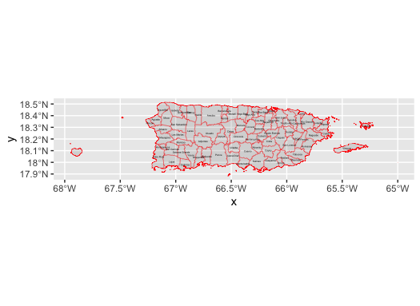
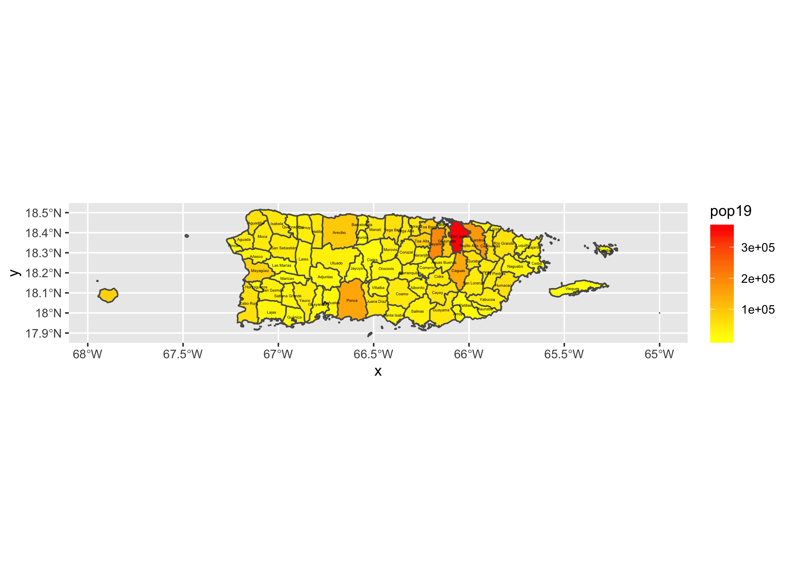
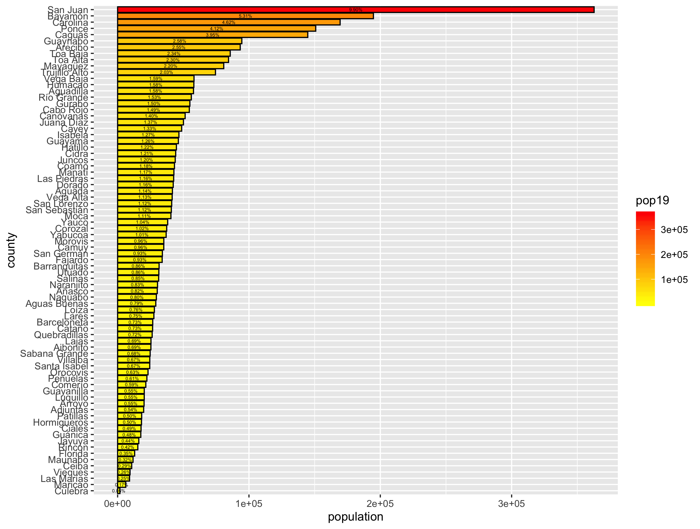
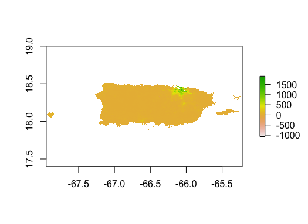
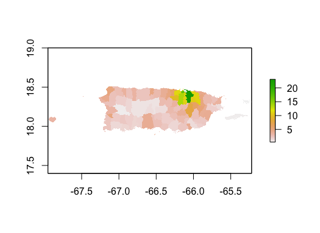
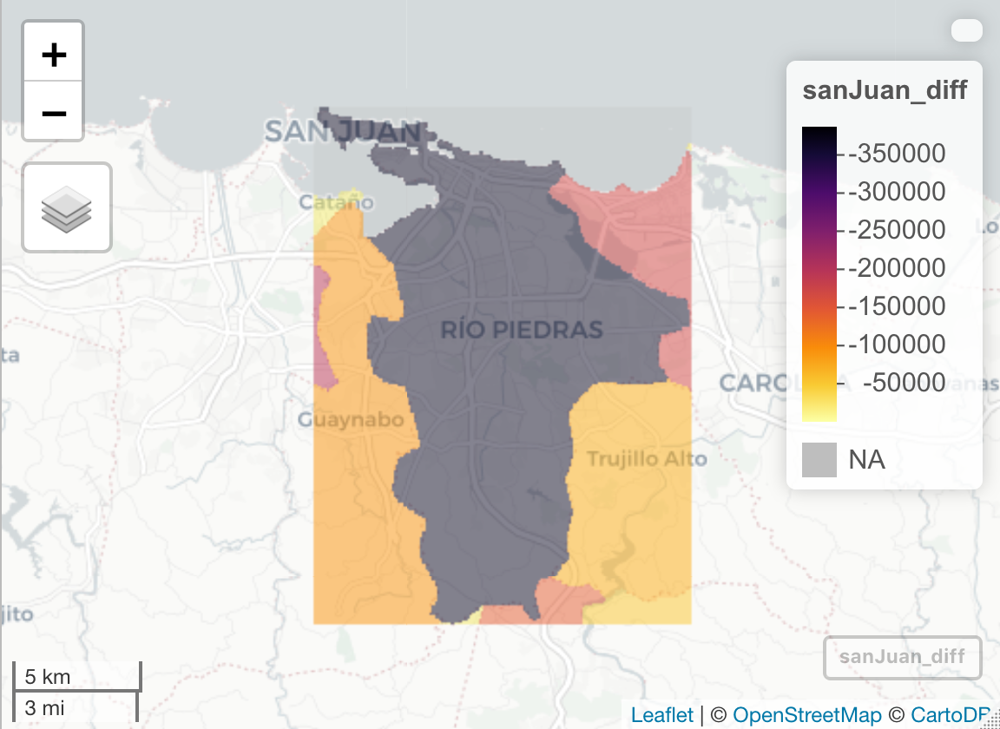

# Puerto Rico

This is my final project for Puerto Rico

## ADMINISTRATIVE SUBDIVISIONS OF PUERTO RICO

### Puerto Rico is an island and U.S. territory located in the Caribbean Sea in Central America. The political subdivisions of Puerto Rico consist of international borders and 78 different municipalities. Each municipality elects a mayor and legislature to govern and control day to day life in the municipality. I selected the municipality of Caguas, Puerto Rico for my project. Caguas is located on the eastern side of Puerto Rico and shares its northern border with the municipality of San Juan. Caguas also shares its border with the municipalities of Aguas Buenas, Cidra, and Cayey to the west, and San Lorenzo, Gurabo, and Trujillo Alto to the east. 

## POPULATION OF PUERTO RICO'S MUNICIPALITIES
### The population of Puerto Rico is three million and is greatly affected by the topography. Puerto Rico is very mountainous in its southern regions, resulting in the most populous areas to be located towards the north. 
#### This plot demonstrates the mountainous regions in the southern regions of Puerto Rico

### Of Puerto Rico's municipalities, San Juan is the most populated. This is expected because San Juan, the capital of Puerto Rico is located in the municipality. San Juan is by far the most densely populated municipality in Puerto Rico, with Bayamón, the second most dense municipality, a little more than half as densely populated.

### Puerto Rico's population mostly lives in towns and villages across rural areas. A dense population lives in large cities like San Juan and Caguas, but the population is smaller compared to the Puerto Ricans living in smaller towns. 

## MAP VIEW OF SAN JUAN, PUERTO RICO

